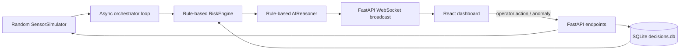

# Repository Baseline

**Status: VERIFIED (inspection), PARTIALLY VERIFIED (runtime)**  
**Date:** 2026-08-02  
**Session intent:** AUDIT_ANALYSIS (high confidence)

## Repository and Git state

- Root: `C:/Users/dcp69/Desktop/liveops-ai` (`git rev-parse --show-toplevel` matched the opened folder).
- Starting branch: `main`; audit branch created: `audit/rul-project-strengthening`.
- Starting commit: `e86837f` (`Initial commit: AetherLive ERP Predictive Maintenance Dashboard with self-healing Safety Interlocks`).
- The worktree was already substantially dirty. Existing modified/deleted backend and frontend files and all untracked assets were preserved. No reset, clean, checkout, history rewrite, push, or deletion was performed.
- Root `.gitignore` is deleted in the worktree. The committed version ignores Node, Python cache, and SQLite files. It does not cover artifacts, datasets, virtual environments, coverage, or common local secrets.
- Large untracked inputs include `v0-compute-11.vercel.app.zip` (~13.3 MB), `motionsites.ai.zip` (~7.2 MB), images, and unpacked website assets. No dataset or trained model artifact was found.

## Project structure

```text
liveops-ai/
├── backend/
│   ├── app/                 # FastAPI, simulator, rules, SQLite ledger, websocket
│   ├── requirements.txt     # fastapi, uvicorn, pydantic, numpy (unversioned)
│   └── run.py               # uvicorn entry point with reload
├── frontend/
│   ├── src/App.jsx          # ~2,300-line React application
│   ├── src/App.css
│   ├── src/index.css
│   ├── package.json         # Vite/React/Recharts
│   └── public/              # presentation assets
├── PRD.md / ROADMAP.md      # current product documentation
├── generate_pdfs.py
└── assorted untracked archives/assets
```

There are no dataset, notebook, training, evaluation, artifact, or test directories in the current project.

## Environment and commands

- Python: 3.14.2, global interpreter at `C:/Python314`; no virtual-environment declaration.
- Python dependency manager: pip with `backend/requirements.txt`; versions are not pinned.
- Node: 24.13.0; npm 11.6.2; lockfile present.
- Backend start: `cd backend; python run.py` (verified from source; launches Uvicorn on `127.0.0.1:8000` with reload).
- Frontend start: `cd frontend; npm run dev`.
- Frontend build: `cd frontend; npm run build`.
- Frontend lint: `cd frontend; npm run lint`.
- Training, evaluation, model generation, and prediction commands: **do not exist**.
- Test command: no repository command or tests exist; `python -m pytest -q` fails because pytest is not installed.

## Current application workflow



This is a simulated monitoring and intervention dashboard. It is not currently a historical-data RUL training application.

## Baseline results

| Check | Result | Evidence |
|---|---|---|
| Dependencies | PARTIALLY VERIFIED | Existing imports work; versions unpinned; pytest absent. |
| Python compilation | VERIFIED | `python -m compileall -q backend` passed. |
| Imports/generation | VERIFIED | FastAPI app, simulator, and risk engine imported; one event and risk result generated. |
| Backend startup | PARTIALLY VERIFIED | Uvicorn reload process started/listened; automated probe timed out during subprocess teardown. |
| Data loading | BLOCKED | No historical dataset or loader exists. |
| Training/evaluation/artifacts | BLOCKED | No corresponding code or command exists. |
| Prediction | PARTIALLY VERIFIED | Heuristic `predicted_ticks_to_failure` executes; it is not a trained RUL prediction. |
| UI build | VERIFIED | Vite build passed; bundle warning: main JS 619.08 kB minified. |
| UI lint | BLOCKED | 14 errors and 1 warning in `frontend/src/App.jsx`. |
| Tests | BLOCKED | No tests; pytest missing. |

Example baseline output showed simulator `rul=150.8` while the risk engine returned `predicted_ticks_to_failure=999.0`; the engine also logged `no such table: decisions` when invoked outside application startup.

## Initial blockers and uncertainties

1. **P0:** no valid supervised RUL dataset, labels, model, split, metrics, or artifact exists.
2. **P0:** `rul` is a stochastic risk-derived display value, not observed remaining life.
3. **P1:** units conflict: backend/PRD says ticks; UI displays hours (`h`).
4. **P1:** claimed AI, confidence, savings, encryption, and prediction behavior are largely rule-derived or hard-coded.
5. Existing user changes are broad and uncommitted; new work must avoid overwriting them.
6. NASA currently describes C-MAPSS as unavailable for official download, so acquisition must be explicit and verified rather than silently mirrored.
