# Backend Architecture

## Boundary

`rul_predictor.RULService` is the only integration boundary a future frontend needs. A frontend supplies a `PredictionRequest`, calls service methods, and renders typed results. It must not calculate features, maintenance status, ranges, importance, or metrics.

```mermaid
flowchart LR
    R[Raw trajectory] --> V[validation]
    V --> T[target: training only]
    T --> F[causal features]
    F --> S[machine split]
    S --> M[three candidate pipelines]
    M --> E[validation selection]
    E --> A[versioned trusted artifact]
    A --> C[RULService cache]
    C --> P[typed PredictionResult]
```

## Module responsibilities

| Module | Single responsibility |
|---|---|
| `config.py` | Immutable schema, training, maintenance, path, and subset configuration |
| `schemas.py` | Typed public requests, results, reports, metadata, and states |
| `exceptions.py` | Expected user-safe backend failures |
| `data_loading.py` | Exact 26-column C-MAPSS and official truth loading |
| `validation.py` | Authoritative strict validation plus safe quality warnings |
| `target.py` | Cycle-based run-to-failure target |
| `features.py` | Shared causal current/trailing feature implementation and order |
| `splitting.py` | Deterministic group split and three-way overlap assertion |
| `training.py` | Equal-sample candidate fitting, selection, refit, interval evidence |
| `evaluation.py` | Typed metrics and row-level evidence |
| `explainability.py` | Held-out permutation importance, native support, recent changes |
| `artifacts.py` | Trusted-local persistence and integrity validation |
| `service.py` | Cached artifact, validation, inference, warnings, status, metadata |
| `inference.py` | Backward-compatible dictionary wrapper over `RULService` |

The old `backend/` FastAPI simulator is intentionally retained legacy code and is not imported by the RUL package. `app.py` remains frozen; future UI work should migrate from the compatibility wrapper to `RULService` directly.
