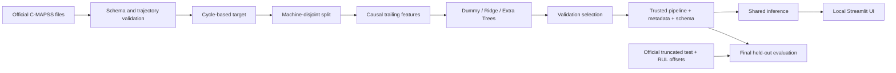

# Architecture

Responsibilities are separated across data loading, validation, target generation, features, splitting, training, evaluation, artifacts, and inference. Machine ID is grouping metadata, never a numeric model feature. Preprocessing resides inside scikit-learn pipelines. The UI does not reimplement feature logic and never loads user-uploaded model files.
